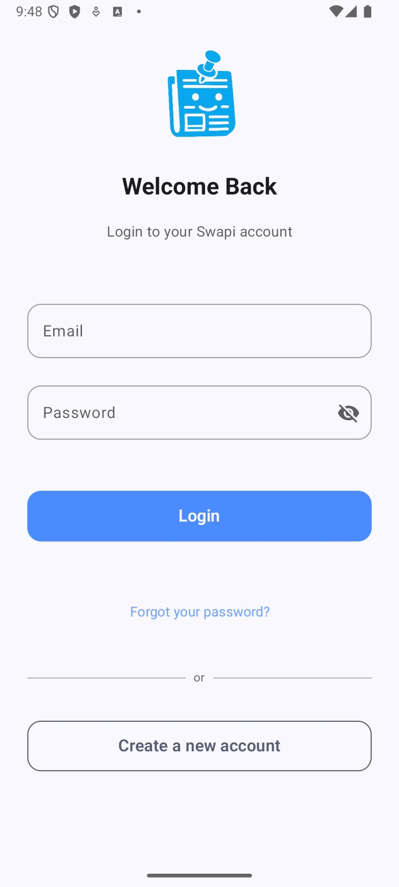
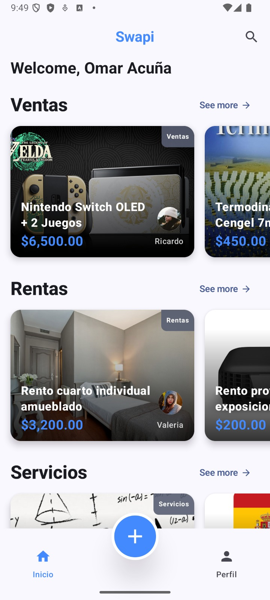

# Swapi

A private digital marketplace for university communities.

Swapi is a digital platform designed for university students and faculty to buy, sell, rent, offer services, and share university-related announcements in a secure and private environment.  
The first deployment is focused on La Salle University in Chihuahua, Mexico, with future scalability to other institutions.

## 1. Project Description

Swapi functions as a private online marketplace exclusively for members of the university community.  
The main goal is to provide a safe and reliable digital space where users can interact using their institutional email accounts, ensuring that every participant belongs to the same academic environment.

The system currently includes:
- A backend implemented with Node.js and Express.js following REST API principles.
- A MongoDB database managed through Mongoose for flexible and scalable data storage.
- A web frontend developed in React connected to the same backend.
- An Android app created with Kotlin and Jetpack Compose that also consumes the same API.

## 2. Objective and Current Scope

The current objective of Swapi is to establish the first fully functional version of a university-exclusive marketplace.  
This version includes secure authentication, email verification, and full management of user-generated announcements.

Scope of the current implementation:
- Backend implemented with REST API endpoints for authentication, users, categories, and posts.
- Secure authentication using JWT.
- Email verification system using Nodemailer.
- CRUD operations for user announcements.
- Web platform in React connected to the API.
- Mobile version in Android using the same backend.
- Database designed with a document-oriented structure in MongoDB.

## 3. Implemented Functionalities

### User Features
- Registration and account verification via institutional email.
- Login with JWT-based authentication.
- Creation, editing, and deletion of announcements.
- Viewing and searching through all announcements.
- Filtering by category (Sales, Rentals, Services, Information, University Announcements).
- Profile management.

### Admin Features
- Viewing all registered users.
- Deleting or disabling user accounts.
- Reviewing and moderating user announcements.
- Accessing basic analytics about users and posts.

## 4. Architecture

Swapi follows a client-server architecture divided into three main layers:

swapi-project/
├─ backend/       → Node.js + Express.js (REST API) + MongoDB (Mongoose)
├─ web-frontend/  → React.js (connected to API)
└─ mobile-app/    → Android (Kotlin + Jetpack Compose + MVVM)

All clients communicate through the same REST API, ensuring consistency between platforms.

## 5. Git Workflow

The team follows a feature-branch Git workflow:

1. The main branch (main) contains the stable production code.
2. Development is done in feature branches named with the following pattern:
   - feat/feature-name
3. Pull requests are reviewed before merging into main.
4. Commit messages follow a descriptive and consistent format.

## 6. Team Roles

| Member | Role |
|--------|------|
| Ian | Full Stack & Mobile Developer | 
| Omar | Full Stack & Mobile Developer |

## 7. Current Progress Screenshots

### Mobile App – Login Screen

## 8. License

This project was developed as part of the Mobile programming I course at Universidad La Salle Chihuahua.  
All rights reserved to the Swapi Development Team.  
For academic and educational use only.